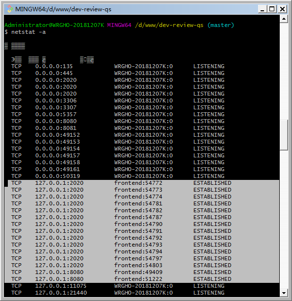

### 基于 TCP 和 UDP 协议的  Socket 编程

Socket 可以作插口或者插槽讲。

写Socket软件程序，可以想象为弄一根网线，一头插在客户端，一头插在服务端，然后进行通信。

所以在通信之前，双方都要建立一个 Socket。

----

### 建立 Socket

在建立 Socket 的时候，应该设置什么参数呢？ 

Socket 编程进行的是端到端的通信，往往意识不到中间经过多少局域网，多少路由器，因为能够设置的参数，也只能是端到端协议之上网络层和传输层的。

（-- 这句话看得有点模糊，你要表达的意思是“设置的参数只能是协议之上的网络层和传输层相关的”？）

在网络层，Socket 函数需要指定是 IPv4 还是 IPv6，分别对应设置为 AF_INET 和 AF_INET6。
另外，还要指定到底是 TCP 还是 UDP。
TCP 协议是基于数据流的，所以设置为 SOCKET_STREAM，而 UDP 是基于数据报的，因而设置为 SOCKET_DGRAM。

### 基于 TCP 协议的 Socket 程序哈数调用过程

TCP 的服务端要先监听一个端口，一般是先调用 bind 函数，给这个 Socket 赋予一个 IP 地址和端口。

***为什么需要端口呢？***

要知道，你写的是一个应用程序，当一个网络包来的时候，内核要通过 TCP 头里面的这个端口，来找到你这个应用程序，把包给你。

***为什么要 IP 地址呢？***
有时候，一台机器会有多个网卡，也就会有多个 IP 地址，你可以选择监听所有的网卡，也可以选择监听一个网卡。这样，只有发给这个网卡的包，才会给你。

当服务端有了 IP 和端口号，就可以调用 listen 函数进行监听。在 TCP 的状态图里面，有一个 listen 状态，当调用这个函数之后，服务端就进入了这个状态，这个时候客户端就可以发起连接了。

在内核中，为每个 Socket 维护两个队列。(这里的内核是指 CPU 内核？在windows 环境也是如此？)

- 一个是已经建立了连接的队列，这时候连接三次握手已经完毕，处于 established 状态；

- 一个是还没有完全建立连接的队列，这个时候三次握手还没完成，处于 syn_rcvd 的状态。

接下来，服务端调用 accept 函数，拿出一个已经完成的连接进行处理。如果还没有完成，就要等着。

在服务端等待的时候，客户端可以通过 connect 函数发起连接。先在参数中指明要连接的 IP 地址和端口号，然后开始发起三次握手。

内核会给客户端分配一个临时的端口。一旦握手成功，服务端的 accept 就会返回另一个 Socket。

一个经常考的知识点，就是监听的 Socket 和真正用来传数据的 Socket 是两个，一个叫作监听 Socket，一个叫作已连接 Socket。

