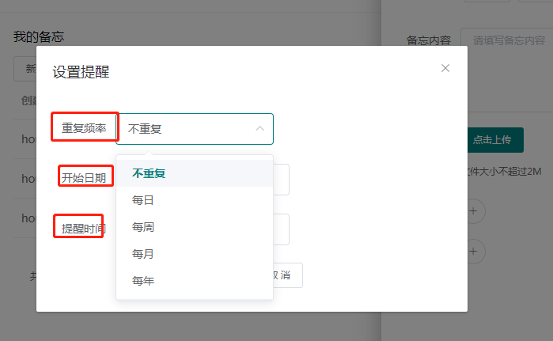

## Front-Page



## A-Perspective

> 基于整体的角度 1-frequency\start\remind_at 是一个整体，有则都有，无则无

```
  if (\in_array($this->conf['frequency'], [0, 1, 2, 3, 4])) {
	$this->addError($attribute, '请选择重复频率');
  }
  if ($this->conf['frequency'] == 2 ) {
	if (!array_filter($this->conf['week'])) {
	  $this->addError($attribute, '提醒日期不能为空');
	}
  }
  if (($this->conf['frequency'] == 3) && !$this->conf['month']) {
	$this->addError($attribute, '提醒日期不能为空');
  }
  if (($this->conf['frequency'] == 4) && !$this->conf['year']) {
	$this->addError($attribute, '提醒日期不能为空');
  }

  if (!$this->conf['start'] ) {
	$this->addError($attribute, '开始日期不能为空');
  }

  if (!$this->conf['remind_at'] ) {
	$this->addError($attribute, '提醒时间不能为空');
  }
  
```


----

## B-Perspective: 

角度，仅仅选择了`存在 frequency `的情况，进行判断处理

```
if (isset($this->conf['frequency']) && ($this->conf['frequency'] != '')) { 
	if (!$this->conf['remind_at'] || !$this->conf['start'])
	{
	  $this->addError($attribute, '开始日期、提醒时间不能为空');
	}

	if ($this->conf['frequency'] == 2 ) {
	  if (!array_filter($this->conf['week'])) {
		$this->addError($attribute, '提醒日期不能为空');
	  }
	}

	if (($this->conf['frequency'] == 3) && !$this->conf['month']) {
	  $this->addError($attribute, '提醒日期不能为空');
	}

	if (($this->conf['frequency'] == 4) && !$this->conf['year']) {
	  $this->addError($attribute, '提醒日期不能为空');
	}
  }
}

```

